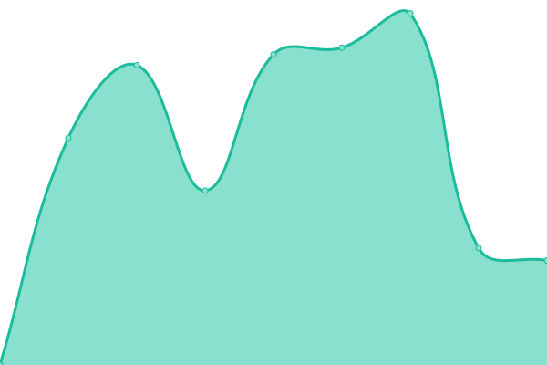
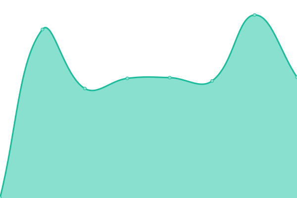

# [📈 Live Status](https://lefuex.github.io/upptime): <!--live status--> **🟩 All systems operational**

This repository contains the open-source uptime monitor and status page for [Sebastian Fuchs](https://lefuex.github.io/upptime), powered by [Upptime](https://github.com/upptime/upptime).

With [Upptime](https://upptime.js.org), you can get your own unlimited and free uptime monitor and status page, powered entirely by a GitHub repository. We use [Issues](https://github.com/lefuex/upptime/issues) as incident reports, [Actions](https://github.com/lefuex/upptime/actions) as uptime monitors, and [Pages](https://lefuex.github.io/upptime) for the status page.

<!--start: status pages-->
<!-- This summary is generated by Upptime (https://github.com/upptime/upptime) -->
<!-- Do not edit this manually, your changes will be overwritten -->
<!-- prettier-ignore -->
| URL | Status | History | Response Time | Uptime |
| --- | ------ | ------- | ------------- | ------ |
|  [Chez Daniel](https://www.chez-daniel.com) | 🟩 Up | [chez-daniel.yml](https://github.com/lefuex/upptime/commits/HEAD/history/chez-daniel.yml) | 

 518ms
     
 | 

<a href="https://status.lefuex.de/history/chez-daniel">100.00%</a>
    

|  [Chor unterwegs](https://www.chor-unterwegs.org) | 🟩 Up | [chor-unterwegs.yml](https://github.com/lefuex/upptime/commits/HEAD/history/chor-unterwegs.yml) | 

 640ms
     
 | 

<a href="https://status.lefuex.de/history/chor-unterwegs">100.00%</a>
    

|  [Eventbackend](https://eventbackend.de) | 🟩 Up | [eventbackend.yml](https://github.com/lefuex/upptime/commits/HEAD/history/eventbackend.yml) | 

 1216ms
     
 | 

<a href="https://status.lefuex.de/history/eventbackend">100.00%</a>
    

|  [GSS Bruno](https://www.gss-bruno.de) | 🟩 Up | [gss-bruno.yml](https://github.com/lefuex/upptime/commits/HEAD/history/gss-bruno.yml) | 

 1229ms
     
 | 

<a href="https://status.lefuex.de/history/gss-bruno">100.00%</a>
    

|  [Hochzeitskribbeln](https://www.hochzeitskribbeln.com) | 🟩 Up | [hochzeitskribbeln.yml](https://github.com/lefuex/upptime/commits/HEAD/history/hochzeitskribbeln.yml) | 

 2003ms
     
 | 

<a href="https://status.lefuex.de/history/hochzeitskribbeln">100.00%</a>
    

|  [Janine Röber](https://www.janine-roeber.de) | 🟩 Up | [janine-roeber.yml](https://github.com/lefuex/upptime/commits/HEAD/history/janine-roeber.yml) | 

 601ms
     
 | 

<a href="https://status.lefuex.de/history/janine-roeber">100.00%</a>
    

|  [Koblenz Tennis](https://www.koblenz-tennis.de) | 🟩 Up | [koblenz-tennis.yml](https://github.com/lefuex/upptime/commits/HEAD/history/koblenz-tennis.yml) | 

 602ms
     
 | 

<a href="https://status.lefuex.de/history/koblenz-tennis">100.00%</a>
    

|  [Lefuex](https://www.lefuex.de) | 🟩 Up | [lefuex.yml](https://github.com/lefuex/upptime/commits/HEAD/history/lefuex.yml) | 

 840ms
     
 | 

<a href="https://status.lefuex.de/history/lefuex">100.00%</a>
    

|  [Miss Evangeline](https://www.miss-evangeline.de) | 🟩 Up | [miss-evangeline.yml](https://github.com/lefuex/upptime/commits/HEAD/history/miss-evangeline.yml) | 

 2809ms
     
 | 

<a href="https://status.lefuex.de/history/miss-evangeline">100.00%</a>
    

|  [Miss Evangeline Business](https://business.miss-evangeline.de) | 🟩 Up | [miss-evangeline-business.yml](https://github.com/lefuex/upptime/commits/HEAD/history/miss-evangeline-business.yml) | 

 3364ms
     
 | 

<a href="https://status.lefuex.de/history/miss-evangeline-business">100.00%</a>
    

|  [Muthandel](https://www.muthandel.de) | 🟩 Up | [muthandel.yml](https://github.com/lefuex/upptime/commits/HEAD/history/muthandel.yml) | 

 1913ms
     
 | 

<a href="https://status.lefuex.de/history/muthandel">100.00%</a>
    

|  [Praxis Fehlerteufel](https://www.praxis-fehlerteufel.de) | 🟩 Up | [praxis-fehlerteufel.yml](https://github.com/lefuex/upptime/commits/HEAD/history/praxis-fehlerteufel.yml) | 

 752ms
     
 | 

<a href="https://status.lefuex.de/history/praxis-fehlerteufel">100.00%</a>
    

|  [Trauringe Siegburg](https://www.trauringesiegburg.de) | 🟩 Up | [trauringe-siegburg.yml](https://github.com/lefuex/upptime/commits/HEAD/history/trauringe-siegburg.yml) | 

 2142ms
     
 | 

<a href="https://status.lefuex.de/history/trauringe-siegburg">100.00%</a>
    

<!--end: status pages-->

[**Visit our status website →**](https://lefuex.github.io/upptime)

## 📄 License

- Code: [MIT](./LICENSE) © [Sebastian Fuchs](https://lefuex.github.io/upptime)
- Data in the `./history` directory: [Open Database License](https://opendatacommons.org/licenses/odbl/1-0/)
