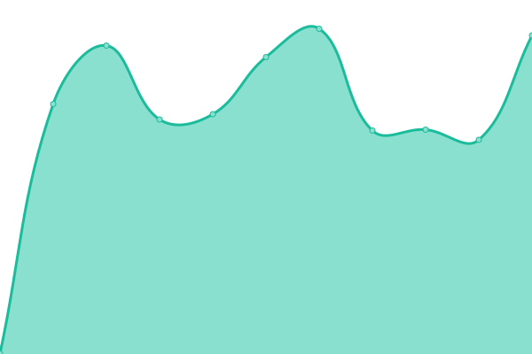
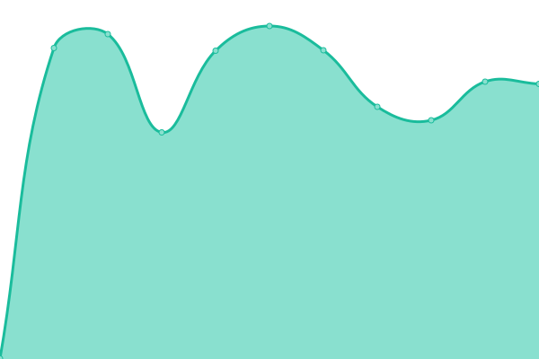

# [📈 Live Status](https://lefuex.github.io/upptime): <!--live status--> **🟩 All systems operational**

This repository contains the open-source uptime monitor and status page for [Sebastian Fuchs](https://lefuex.github.io/upptime), powered by [Upptime](https://github.com/upptime/upptime).

With [Upptime](https://upptime.js.org), you can get your own unlimited and free uptime monitor and status page, powered entirely by a GitHub repository. We use [Issues](https://github.com/lefuex/upptime/issues) as incident reports, [Actions](https://github.com/lefuex/upptime/actions) as uptime monitors, and [Pages](https://lefuex.github.io/upptime) for the status page.

<!--start: status pages-->
<!-- This summary is generated by Upptime (https://github.com/upptime/upptime) -->
<!-- Do not edit this manually, your changes will be overwritten -->

| URL                                                             | Status | History                                                                                                               | Response Time                                                                                  | Uptime                                                                                                                                                                                                                                          |
| --------------------------------------------------------------- | ------ | --------------------------------------------------------------------------------------------------------------------- | ---------------------------------------------------------------------------------------------- | ----------------------------------------------------------------------------------------------------------------------------------------------------------------------------------------------------------------------------------------------- |
| [Chez Daniel](https://www.chez-daniel.com)                      | 🟩 Up  | [chez-daniel.yml](https://github.com/lefuex/upptime/commits/master/history/chez-daniel.yml)                           |  559ms               |                            |
| [Chor unterwegs](https://www.chor-unterwegs.org)                | 🟩 Up  | [chor-unterwegs.yml](https://github.com/lefuex/upptime/commits/master/history/chor-unterwegs.yml)                     |  725ms            |                      |
| [Eventbackend](https://eventbackend.de)                         | 🟩 Up  | [eventbackend.yml](https://github.com/lefuex/upptime/commits/master/history/eventbackend.yml)                         |  1655ms             |                          |
| [GSS Bruno](https://www.gss-bruno.de)                           | 🟩 Up  | [gss-bruno.yml](https://github.com/lefuex/upptime/commits/master/history/gss-bruno.yml)                               |  2640ms                |                                |
| [Hochzeitskribbeln](https://www.hochzeitskribbeln.com)          | 🟩 Up  | [hochzeitskribbeln.yml](https://github.com/lefuex/upptime/commits/master/history/hochzeitskribbeln.yml)               |  1952ms        |                |
| [Janine Röber](https://www.janine-roeber.de)                    | 🟩 Up  | [janine-roeber.yml](https://github.com/lefuex/upptime/commits/master/history/janine-roeber.yml)                       |  693ms             |                        |
| [Koblenz Tennis](https://www.koblenz-tennis.de)                 | 🟩 Up  | [koblenz-tennis.yml](https://github.com/lefuex/upptime/commits/master/history/koblenz-tennis.yml)                     |  725ms            |                      |
| [Lefuex](https://www.lefuex.de)                                 | 🟩 Up  | [lefuex.yml](https://github.com/lefuex/upptime/commits/master/history/lefuex.yml)                                     |  851ms                    |                                      |
| [Miss Evangeline](https://www.miss-evangeline.de)               | 🟩 Up  | [miss-evangeline.yml](https://github.com/lefuex/upptime/commits/master/history/miss-evangeline.yml)                   |  3224ms          |                    |
| [Miss Evangeline Business](https://business.miss-evangeline.de) | 🟩 Up  | [miss-evangeline-business.yml](https://github.com/lefuex/upptime/commits/master/history/miss-evangeline-business.yml) |  3663ms |  |
| [Muthandel](https://www.muthandel.de)                           | 🟩 Up  | [muthandel.yml](https://github.com/lefuex/upptime/commits/master/history/muthandel.yml)                               |  1180ms                |                                |
| [Praxis Fehlerteufel](https://www.praxis-fehlerteufel.de)       | 🟩 Up  | [praxis-fehlerteufel.yml](https://github.com/lefuex/upptime/commits/master/history/praxis-fehlerteufel.yml)           |  869ms       |            |

<!--end: status pages-->

[**Visit our status website →**](https://lefuex.github.io/upptime)

## 📄 License

- Code: [MIT](./LICENSE) © [Sebastian Fuchs](https://lefuex.github.io/upptime)
- Data in the `./history` directory: [Open Database License](https://opendatacommons.org/licenses/odbl/1-0/)
